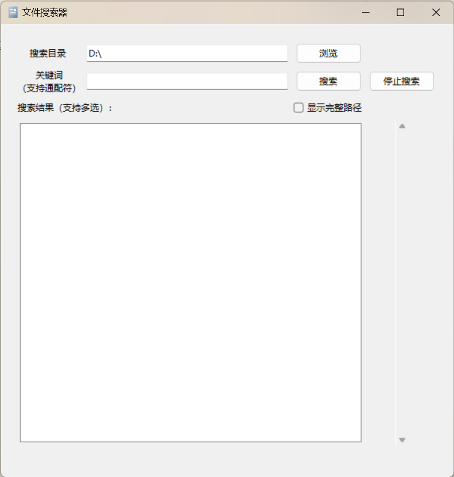

# 文件搜索器

文件搜索器是一个基于Python的图形界面应用程序，旨在帮助用户在指定目录内搜索文件。它支持使用关键字和通配符进行搜索，以高效地定位文件。该应用程序提供了一个用户友好的界面，使用Tkinter构建，提供了各种功能，如打开、复制和删除文件。

## 特点

- **搜索功能**：允许用户使用关键字和通配符搜索文件。
- **多线程搜索**：应用程序使用多线程进行文件搜索，以提高搜索效率并保持界面响应。
- **灵活的显示选项**：用户可以选择显示文件的完整路径或仅文件名。
- **文件操作**：支持打开文件、复制文件路径到剪贴板、打开文件所在位置、将文件复制到新位置以及将文件删除到回收站。
- **自定义搜索目录**：用户可以通过浏览功能选择自定义的搜索目录。
- **状态反馈**：提供状态栏显示当前操作的状态，如搜索完成、文件复制成功等。

## 如何使用

1. 克隆仓库或下载源代码。
2. 确保您的环境中安装了Python和Tkinter。
3. 运行脚本：`python 文件搜索器.pyw`
4. 在搜索目录输入框中输入或选择要搜索的目录。
5. 在关键词输入框中输入搜索关键词，支持通配符。
6. 点击“搜索”按钮开始搜索。
7. 在搜索结果中浏览文件，您可以使用右键菜单进行文件操作。

## 截图

## 依赖

- Python
- Tkinter

## 许可证

